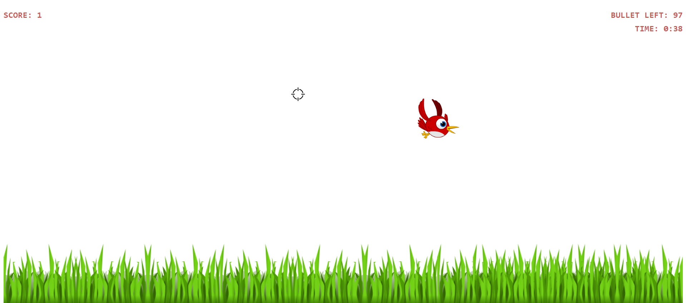

# 🐦 Bird Shooting Game

A fun and simple web-based game built with JavaScript! In **Bird Shooting**, players test their reflexes by shooting birds that appear on the screen. Each successful hit earns a point. Perfect for quick entertainment and improving hand-eye coordination!

## 🎮 Features
- Shoot birds using the mouse click.
- Score points for each hit.
- Simple, intuitive gameplay with real-time scoring.
- Ideal for browsers with no setup required.

## 🚀 Demo  
[Live Demo](https://akmahim.github.io/bird-shooting-game-js) (Replace with your demo link if available)

## 🛠️ Installation
1. Clone the repository:  
   ```bash
   git clone https://github.com/AKmahim/bird-shooting-game-js.git
   cd bird-shooting-game
   ```

## 🕹️ How to Play
- Birds will fly across the screen.
- Use your mouse to aim and click to shoot.
- Earn a point for each bird you successfully hit.
- Try to score as many points as possible!

## 📂 Project Structure

``` 
/bird-shooting-game 
│── index.html # Main HTML file 
│── audio/ # Audio asset folder
│── public/ # JavaScript logic 
│── images/ # Game assets (images, sounds, etc.) 
```

## 🔧 Technologies Used
- HTML5 for structuring the game.
- CSS3 for styling the interface.
- JavaScript for game logic and interactivity.

## 💡 Future Improvements
- Add difficulty levels (birds move faster).
- Implement a leaderboard to track high scores.
- Add sound effects for shooting and scoring.
- Support for touch-based controls (mobile-friendly).

## 📸 Screenshots


## 📝 License
This project is licensed under the MIT License - see the LICENSE file for details.

## 🤝 Contributing
Contributions, issues, and feature requests are welcome!
Feel free to fork the repository and submit pull requests.

## 📬 Contact
For any inquiries, you can reach me at:
Email: me.mahim99@gmail.com
